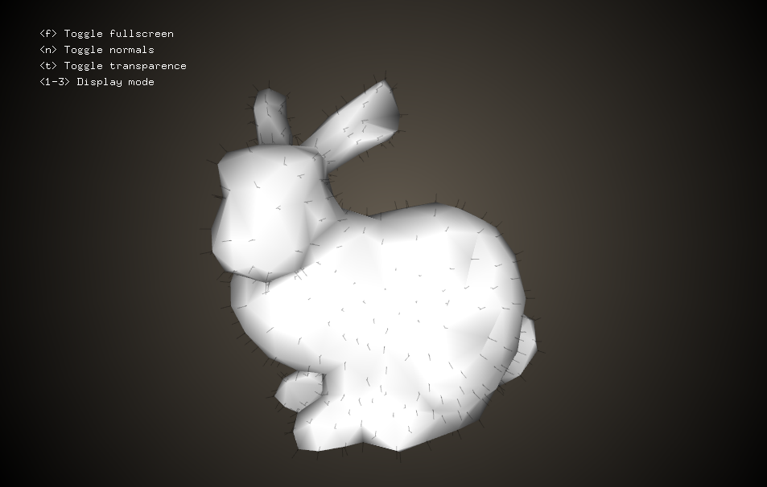

ofxOpenGP
=========

OpenFrameworks addon to use [OpenGP](http://opengp.github.io) (Open Geometry Processing).



Usage
-----
```cpp
#include "ofxOpenGP.h"

// 1. Create your Surface_mesh instance
opengp::Surface_mesh mesh;
mesh.load("data/bunny.obj");

// 2. Play with your instance using OpenGP
...

// 3. Convert to ofMesh / ofVboMesh
ofMesh newMesh;
ofxOpenGP::convert(mesh, newMesh);
```

For a more comprehensive case, look at the project in `example/`.

FAQ
---

**Q. My mesh looks ugly with `ofEasyCam`, what should I do?**

A. First, you may want to normalize it using `ofxOpenGP::normalize`.
This method translates the bounding box center to the origin, and then rescale the mesh to have a maximum width of 1.0f.

As such, it will look tiny when using ofMesh because ofEasyCam doesn't expect a 1-box mesh.
You can either

  - rescale it specifically (see `ofxOpenGP::normalize` and `ofxOpenGP::rescale`), 
  - change your camera settings, or
  - automatically scale it using the 4th parameter of `ofxOpenGP::convert` such as in the example:

```cpp
float scale = 0.5f * std::min(ofGetWidth(), ofGetHeight());
ofxOpenGP::convert(mesh, newMesh, OFX_AUTO_MESH, scale);
```

**Q. My mesh is a polygonal mesh with fancy face valences, what can I do?**

A. OpenGP automatically triangulate meshes in the conversion using `Surface_mesh::triangulate` if needed.
While quad meshes are easy and mostly safe, this may not be the case for general polygons.
You may want to take care of the topology yourself beforehand.

**Q. Can you tell us more about `ofxOpenGP::convert`?**

A. Here it is:

```cpp
bool ofxOpenGP::convert(opengp::Surface_mesh &mesh,
                        ofMesh &newMesh,
                        ofxMeshType meshType,
                        float scaling = 1.0f);
```

  - `mesh`: your surface mesh from OpenGP (not `const` as we use triangulate when needed)
  - `newMesh`: your `ofMesh` for an easy display within OpenFrameworks
  - `meshType`: one of `OFX_AUTO_MESH`, `OFX_TRIANGLE_MESH` and `OFX_QUAD_MESH`
  - `scaling`: a factor by which to scale the vertex positions (because of `ofEasyCam`)
  - returns `true` if it worked without error, `false` in case an error occurred

License
-------
Released under the [MIT License](http://www.opensource.org/licenses/MIT).
